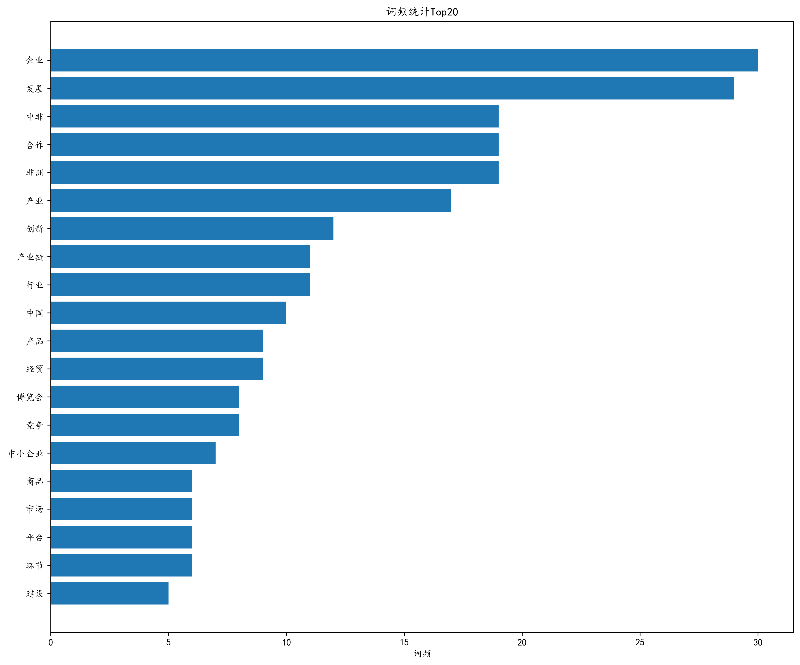
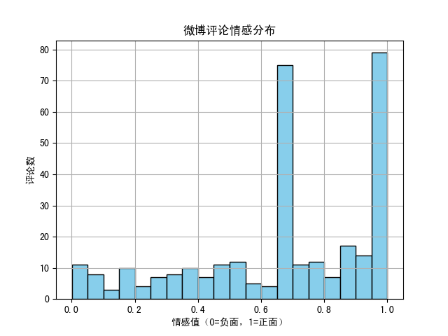
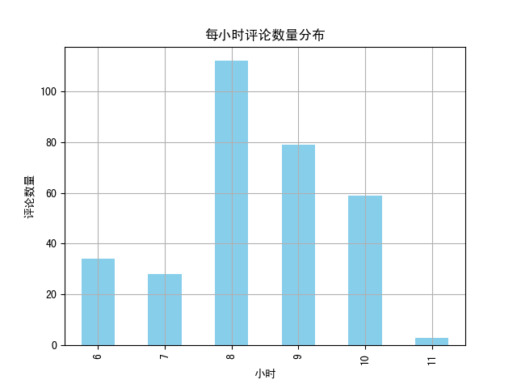

# 📦 大数据项目实验：新闻与微博评论数据分析

## 📌 项目简介

本项目以实际文本数据为基础，分别从凤凰网与微博平台采集新闻内容和评论数据，借助 Hadoop 与 Spark 平台完成数据清洗与分析处理，生成词云、词频统计图和情感分析图等可视化结果，展示大数据处理与文本挖掘的基本流程。

## 🔍 实验内容

- **新闻数据爬取**：利用 Selenium 爬取凤凰网首页新闻正文内容。
- **微博评论采集**：通过调用微博移动端 API 接口获取指定微博的热门评论。
- **数据处理与分析**：
  - 中文分词与停用词过滤（基于 `jieba`）
  - 词频统计与可视化（使用 `matplotlib`）
  - 评论情感倾向分析（使用 `SnowNLP`）
  - 基于 Spark 实现数据清洗、字段提取与分布式处理
- **可视化输出结果**：
  - 新闻词云图与 Top20 高频词条形图
  - 微博评论词云图、情感值分布图与小时评论活跃度图


##  📁 项目结构
```bash
├── news/                                # 新闻数据处理模块
│   ├── 停用词/                           # 停用词文件目录
│   ├── 分词结果/                         # 保存新闻分词后的文本
│   ├── 爬取新闻结果/                     # 爬取的原始新闻文本
│   ├── 词频统计结果/                     # 词频统计输出文本
│   ├── mask.jpg                         # 词云形状遮罩图
│   ├── 中文分词.py                      # 分词与清洗脚本
│   ├── 合集.txt                         # 所有爬取新闻合并后的文本
│   ├── 新闻1.png                        # 新闻词云图
│   ├── 爬取新闻.py                      # 凤凰网新闻爬虫脚本
│   ├── 词频排序.py                      # 词频排序处理脚本
│   ├── 词频统计.py                      # 统计词频并绘制图像
│   └── 词频统计_Top20.png               # 新闻词频Top20图
│
├── weibo/                               # 微博数据处理模块
│   ├── Figure_1.png                     # 情感分布图
│   ├── Figure_2.png                     # 评论活跃时间图
│   ├── Figure_3.png                     # 微博评论词云图
│   ├── weibo_comments.csv              # 原始评论数据
│   ├── weibo_comments_analyzed.csv     # 含情感值的分析结果
│   ├── weibo_sentiment.py              # Spark分析与情感分析脚本
│   └── 爬取微博.py                      # 微博评论爬虫脚本
│
└── README.md # 项目说明文件
```
## ⚙️ 环境依赖

- Python 3.x
- Selenium + Edge WebDriver
- jieba、wordcloud、matplotlib、pandas、cv2
- SnowNLP
- Apache Hadoop + Spark
- simkai.ttf / simhei.ttf 字体文件

## 🚀 使用说明

1. **运行爬虫脚本**

   - 新闻爬取（凤凰网）：
     ```bash
     python news/爬取新闻.py
     ```

   - 微博评论爬取：
     ```bash
     python weibo/爬取微博.py
     ```

2. **本地分析与词云生成（新闻）**

   - 执行分词与词频分析：
     ```bash
     python news/中文分词.py
     python news/词频排序.py
     python news/词频统计.py
     ```

3. **Hadoop + Spark 分析（微博）**

   - 将评论 CSV 文件上传至 HDFS：
     ```bash
     hdfs dfs -put weibo/weibo_comments.csv /weibo/input/
     ```

   - 提交 Spark 脚本执行情感分析与图表生成：
     ```bash
     spark-submit weibo/weibo_sentiment.py
     ```

> ⚠️ 确保运行环境已配置以下依赖：
> - `jieba`
> - `wordcloud`
> - `matplotlib`
> - `pandas`
> - `cv2`
> - `SnowNLP`
> - `pyspark`
> - Hadoop 和 Spark 已正确部署并运行


## 📊 结果展示

### 📰 新闻数据分析结果

- **词云图**：
  
  

- **词频Top20条形图**：
  
  

- **分词输出示例文件**：
  - 分词结果：`news/分词结果/a1.txt`
  - 词频统计表：`news/词频统计结果/out.txt`


### 💬 微博评论分析结果

- **词云图**（热门评论关键词）：

  

- **情感值分布图**：

  

- **每小时评论数量图**：

  

- **分析后数据文件**：
  - 原始数据：`weibo/weibo_comments.csv`
  - 含情感值分析结果：`weibo/weibo_comments_analyzed.csv`


## 声明

本项目为2024-2025春季《大数据技术与应用》课程设计项目。
